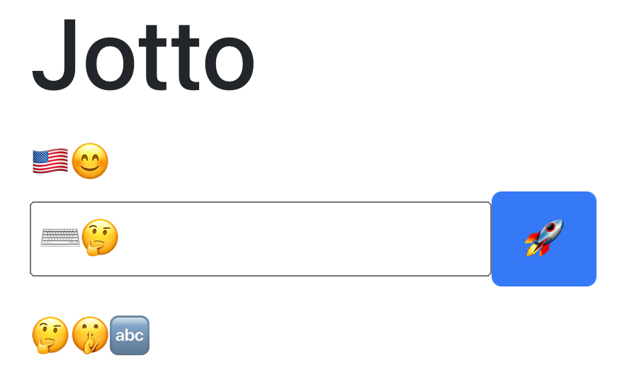
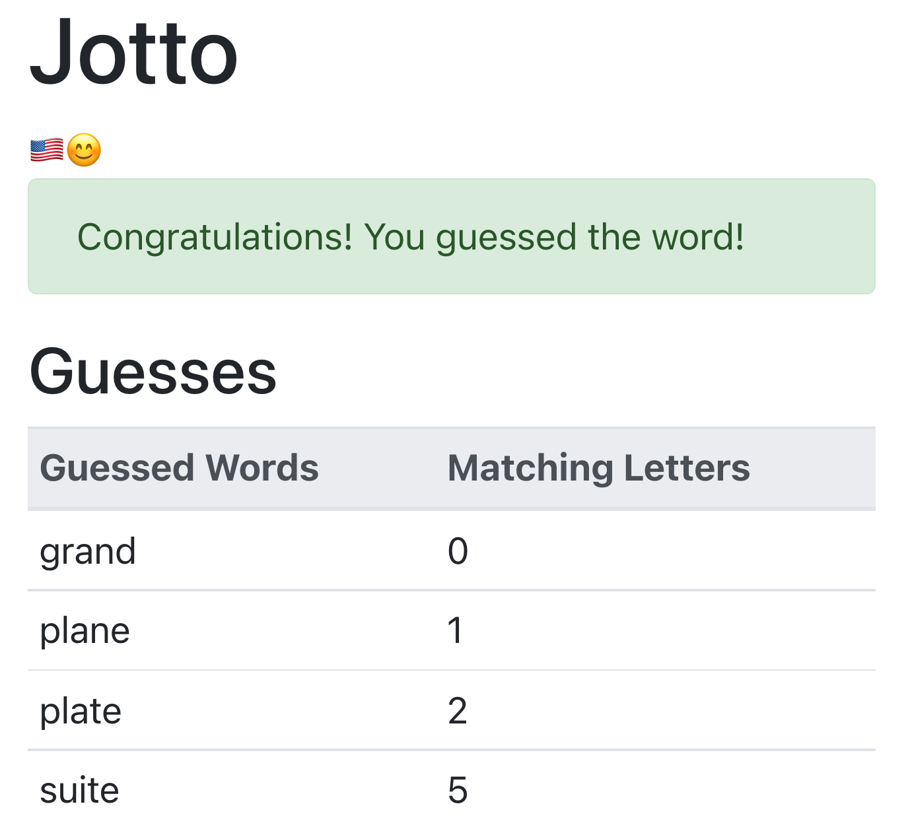

# Jest React Testing Library Demo

## Description

This is a simple [Jotto game](https://en.wikipedia.org/wiki/Jotto) I built to gain more experience testing React apps with _Enzyme_.

While not as popular as it once was, I felt it was important to learn more about _Enzyme_ as some say that [1/3 of React apps are still being tested using Enzyme](https://dev.to/wojtekmaj/enzyme-is-dead-now-what-ekl).

While I think _Enzyme_ is on its way out, I still had a lot of fun going through this course. The knowledge I used will be valuable as I help my company transition from testing with _Enzyme_ to testing with _React Testing Library_ :D

## Images

## Notes

I built this app while going through [Bonnie Schulkin's React Testing with Jest and Enzyme course](https://www.udemy.com/course/react-testing-with-jest-and-enzyme/) on Udemy.

The course included lectures, "follow along" lessons and a number of coding challenges.

## Commands

### Running the App

After installing its dependencies using

> npm install

You can run this app by running:

> npm start

Please note, however, that you may receive some errors if you try running this app without also locally running the [server code that accompanies it](https://github.com/bonnie/udemy-ENZYME/tree/main/random-word-server).

### Launching the Test Runner

You can launch the test runner in the interactive watch mode with the following command:

> npm test
